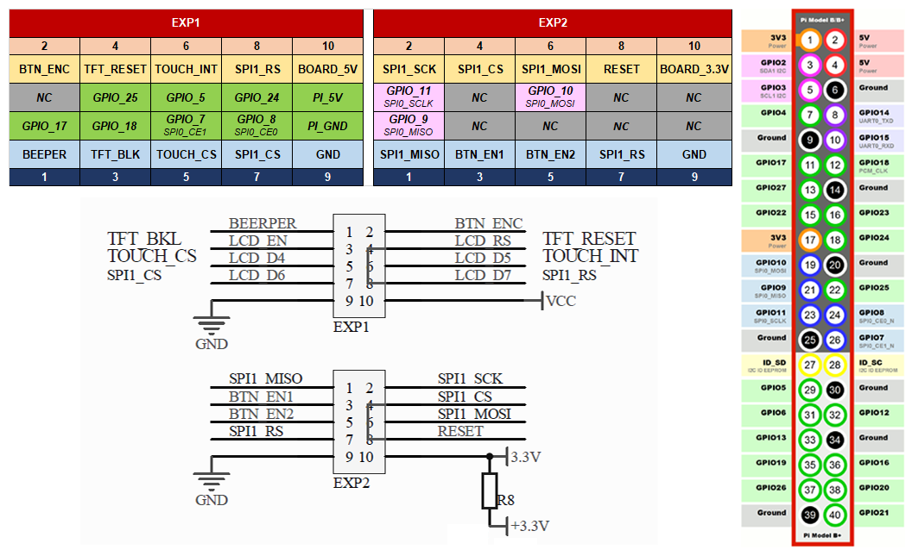

# MKS TS35 with KlipperScreen on Raspberry Pi from scratch

## Notes
* This guide is mostly based on [willngton](https://github.com/willngton) guide on how to [connect MKS TS35 screen in Raspberry Pi to run Klipperscreen](https://github.com/willngton/3DPrinterConfig/tree/main/mks_ts35), which is also based on other guides (see his git for details).
* Due to some Linux kernel and Xorg changes, the touchscreen calibration would not work anymore, thus the necessity of this guide.
* ~~This was validated with [Raspberry Pi Os Lite 32-bit, release September 6th 2022, kernel 5.15, Debian 11 (bullseye)](https://downloads.raspberrypi.org/raspios_lite_armhf/images/raspios_lite_armhf-2022-09-07/).~~
* Updated and tested with [release from September 22th 2022](https://downloads.raspberrypi.org/raspios_lite_armhf/images/raspios_lite_armhf-2022-09-26/).
* If something goes wrong, break, or don't work, unload the screen device tree from step 5 and redo everything. 

## 1. Prepare the system and wiring
### 1.1. System
Write RaspiOS Lite image in your microSD card, connect either via SSH or Serial, download [KIAUH](https://github.com/th33xitus/kiauh), and within the script, proceed installing Klipper, Moonraker, your favorite web interface (Mainsail or Fluidd), and KlipperScreen.

You may need to install git before being able to clone the repositories.
```
sudo apt update
sudo apt install git -y
```

### 1.2. Wiring


## 2. Edit Xorg X server binary wrapper
```
sudo nano /etc/X11/Xwrapper.config
```

* Add these lines in the bottom of the file:
```
needs_root_rights=yes
````

## 3. Install OpenGL driver for fake KMS
```
sudo apt install gldriver-test -y
```

## 4.  Setup framebuffer copy
* Install binaries:
```
sudo apt-get install cmake -y
cd ~
git clone https://github.com/tasanakorn/rpi-fbcp
cd rpi-fbcp/
mkdir build
cd build
cmake ..
make
sudo install fbcp /usr/local/bin/fbcp
```
* Create service:
```
sudo nano /etc/systemd/system/fbcp.service
```
* Add the contents below to the file.
```
[Unit]
Description=fbcp
After=KlipperScreen.service
StartLimitIntervalSec=0
[Service]
Type=simple
Restart=always
RestartSec=1
User=root
ExecStart=/usr/local/bin/fbcp
[Install]
WantedBy=multi-user.target
```
`CTRL+X` to exit, and press `Y` to confirm changes to the file.

* Enable the fbcp service.
```
sudo systemctl enable fbcp.service
```

## 5. Load drivers and device tree in configuration file
```
sudo nano /boot/config.txt
```
* Change `dtoverlay=vc4-kms-v3d` to `dtoverlay=vc4-fkms-v3d` (around line 62).

* Add these lines in the bottom of the file:
```
dtoverlay=disable-bt

# MKS TS35
dtparam=spi=on
hdmi_cvt=480 320 60 1
hdmi_group=2
hdmi_mode=87
display_rotate=0
dtoverlay=tinylcd35,touch
```
`CTRL+X` to exit, and press `Y` to confirm changes to the file.

**Reboot host and reconnect. After booting, KlipperScreen must load after console screen.**

## 6. Touchscreen calibration
Here's where things are a bit different from the original guide. Instead of using `xinput-calibrator`, use `xlibinput-calibrator`.

Follow the instructions in it's [GitHub page](https://github.com/kreijack/xlibinput_calibrator) to resolve dependencies and compile, or:
```
sudo apt install libxfixes-dev libxi-dev libxrandr-dev x11proto-input-dev x11proto-randr-dev -y
cd ~
git clone https://github.com/kreijack/xlibinput_calibrator
cd xlibinput_calibrator/src/
make
g++ -MT main.o -MMD -MP -MF .d/main.Td -Wall -pedantic -std=c++17 -c -o main.o main.cc
sudo install xlibinput_calibrator /usr/local/bin/xlibinput_calibrator
```

List your displays with `DISPLAY=:0 xlibinput_calibrator --list-devices`, you should see your SPI screen ID and name:
```
pi@klipper:~ $ DISPLAY=:0 xlibinput_calibrator --list-devices
  6: ADS7846 Touchscreen
        Coordinate Transformation Matrix: 1.000000, 0.000000, 0.000000, 0.000000, 1.000000, 0.000000, 0.000000, 0.000000, 1.000000
        Device Enabled: 1
        Device Node: /dev/input/event0
        Device Product ID: 0, 0
        libinput Calibration Matrix: 1.000000, 0.000000, 0.000000, 0.000000, 1.000000, 0.000000, 0.000000, 0.000000, 1.000000
        libinput Calibration Matrix Default: 1.000000, 0.000000, 0.000000, 0.000000, 1.000000, 0.000000, 0.000000, 0.000000, 1.000000
        libinput Send Events Mode Enabled: 0, 0
        libinput Send Events Mode Enabled Default: 0, 0
        libinput Send Events Modes Available: 1, 0
```

You can either run the calibration routine with your display name or ID:
```
sudo DISPLAY=:0 xlibinput_calibrator --output-file-x11-config=/usr/share/X11/xorg.conf.d/99-calibration.conf --device-name="ADS7846 Touchscreen" --verbose
```
or
```
sudo DISPLAY=:0 xlibinput_calibrator --output-file-x11-config=/usr/share/X11/xorg.conf.d/99-calibration.conf --device-id=6 --verbose
```
Follow the instructions on the screen. Use a stylus type pen for more precision. The calibration matrix will be automatically calculated and saved to `/etc/X11/xorg.conf.d/99-calibration.conf`


# Final checks
Reboot host and type `DISPLAY=:0 xinput list-props "ADS7846 Touchscreen"  | grep "libinput Calibration Matrix"`, your current calibration should persist between shutdowns and reboots, and touch is spot on.

# Extra - connect MKS TS35 buzzer for Marlin like "M300: Play Tone"

MKS TS35 screen has an active buzzer that can be used by Klipper macros to play tones. Differently from the LCD itself which is fed with 5v, the buzzer logic level is 3.3v (fed by Raspberry Pi GPIO logic level), requiring one more wire to be connected.

Flash [RPi Microcontroller service as described in Klipper documentation](https://www.klipper3d.org/RPi_microcontroller.html) so Klipper can access Raspberry Pi GPIO.

Add these lines in you `printer.cfg`:
```
[mcu rpi]
serial: /tmp/klipper_host_mcu

[output_pin BEEPER_Pin]
pin: rpi:gpio17 # for Raspberry Pi
pwm: True
```

Add this macro in your `macros.cfg` or whatever the structure you have in your machine settings. [Source](https://www.reddit.com/r/klippers/comments/o775te/create_marlin_like_m300_beeper_tone/).
```
[gcode_macro M300]
gcode:  
     ; S sets the tone frequency
     ; P sets the tone duration
     ; L varies the PWM on time, close to 0 or 1 the tone gets a bit quieter. 0.5 is a symmetric waveform
     ; dont divide through zero
    
    
     ;max frequency set to 10kHz
    
    
     ;convert frequency to seconds 
    
    SET_PIN PIN=BEEPER_Pin VALUE={L} CYCLE_TIME={F} ;Play tone
    G4 P{P} ;tone duration
    SET_PIN PIN=BEEPER_Pin VALUE=0

[gcode_macro BUZZER_TEST]
gcode:
    M300 S1000 P100
    M300 S1000 P100
    M300 S1000 P100
```
Save and restart to apply changes, test with `BUZZER_TEST`.
